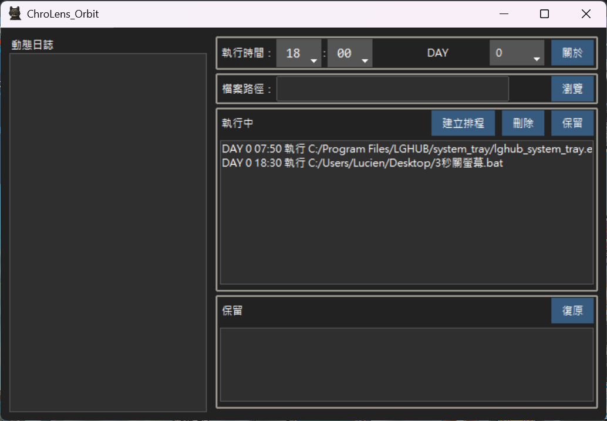

此工具把「Windows工作排程」在建立"定時開啟檔案"的功能獨立出來。
更簡單的直接新增和刪除排程。
同時強化功能，使捷徑檔案(.lnk)也能在指定的時間被啟動
# Day 0 = Everyday

e.g. 每天晚上21:00自動開啟Chrome.lnk、21:01自動開啟line.exe
每週五六日19:31自動開啟MonsterHunterWilds.exe

---
# [ChroLens Project](https://home.gamer.com.tw/artwork.php?sn=6150515) 
## [ChroLens_Portal](https://github.com/Lucienwooo/ChroLens_Portal)_批次開關分組的檔案、快捷鍵切換複數視窗置頂顯示。 
## [ChroLens_Mimic](https://github.com/Lucienwooo/ChroLens_Mimic)_巨集錄製工具、鍵鼠模擬、按鍵精靈。 
## [ChroLens_Clear](https://github.com/Lucienwooo/ChroLens_Clear)_自動關閉複數視窗/程式 
## [ChroLens_Orbit](https://github.com/Lucienwooo/ChroLens_Orbit)_簡易版工作排程器，支援開啟捷徑.lnk檔案 

---
#### 📄 授權資訊 (Licensing)  

[LICENSE](LICENSE)

---

### 💸 支持作者 / Support the Creator / 作者を応援する💸
 
 **這些程式幫你省下的時間，分一點來抖內吧！給我錢錢！**   
 **These scripts saved you time—share a bit and donate. Give me money!**     
 **このツールで浮いた時間、ちょっとだけ投げ銭して？お金ちょうだい！**   

👉如果你有任何問題、想法或建議，請加入我的 [Discord ChroLens](https://discord.gg/72Kbs4WPPn)

